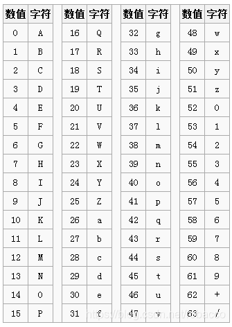
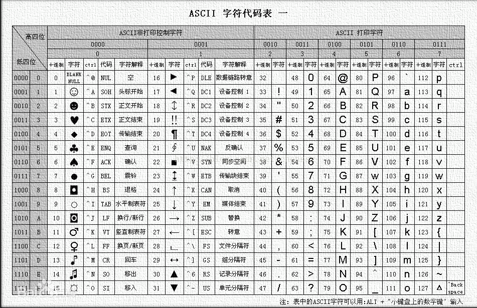
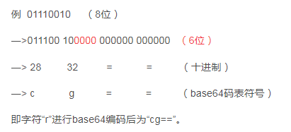
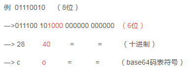

# Base64隐写
## base64编码
base64就是一种基于64个可打印字符来表示二进制数据的表示方法，包含字符"A-Z、a-z、+、/"64个字符。编码表如下图：
  

base64编码原理：

base64由64个字符组成，使用6位即可表示，而一个字节由8位二进制组成，所以最后需要将8位拆分为6位二进制。

例如给定一个字符，首先需要对应ASCII码表的值，并将其转换为二进制，如“r”对应114，二进制为01110010。接着需要把8位二进制划分为6位，不足6位的在后面补零，使其是6的倍数。然后将其对应base64码表的字符，000000对应“=”即可。

例
|011100|10|-|-|8位|
|:---|:---|:---|:---|:---|
|011100|100000|000000|000000|6位|
|28|32|=|=|十进制|
|c|g|=|=|base64码表符号|
即字符“r”进行base64编码后为“cg==”。

解码就是编码的逆过程：
首先去掉等号, 再根据base64码表将对应字符转为二进制数，然后从左到右, 每8 个位一组, 并将多余位扔掉, 转为对应的 ASCII 码即可。
  

----

## base64隐写原理：

回顾上面的例子，图中红色部分就是隐写位（4位），因为解码过程中会丢掉多余的位（就是红色），所有在其中进行隐写不会影响解码的结果。
  

若把红色的位改成如下：
  

即字符“r”进行base64编码后为“co==”，解码结果仍然和“cg==”一样是字符“r”，所以在隐写位进行隐写不会修改最终的解码值。

接下来再举一例，编码字符“ro”
|r|o|-|-|-|
|:---|:---|:---|:---|:---|
|01110010|01101111|
|011100|100110|1111100|000000|红色代表隐写位，2位|
|28|38|60|=||
|c|m|8|=|base64码表符号|

即字符“ro”进行base64编码后为“cm8=”。

从以上两个例子可以得出：若编码结尾有一个“=”，表示可隐写2位，两个“=”表示可隐写4位。

例子:
XCTF 新手组 011
```python
# XCTF 新手组 011
string2 = "ABCDEFGHIJKLMNOPQRSTUVWXYZabcdefghijklmnopqrstuvwxyz0123456789+/"
f1 = open(r"stego.txt", mode='r', encoding='utf-8')
li = str(f1.readline())
arr = []
get_sub_ans = ""
ans = ""

while li:
    arr.append(li[-5:-1])
    li = f1.readline()  # 分行读取

for i in range(0, len(arr), 1):
    if arr[i][-1] == '=' and arr[i][-2] == '=':  # 如果两个等号
        bin_index = bin(string2.find(arr[i][1]))  # 将第二个字符转化为string2中的对应十进制index，再转为二进制；
        if len(bin_index) < 6:  # 判断是否需要补0
            b_head = bin_index.find('b')+1  # b的位置
            after_b = bin_index[b_head:]  # b后的串
            after_b = after_b.zfill(4)  # 将分离的串前面加上0补齐到四位
            ans = ans + after_b[-4:]
        else:
            ans = ans + bin_index[-4:]
    elif arr[i][-1] == '=':  # 如果一个等号
        bin_index = bin(string2.find(arr[i][2]))  # 将第三个字符转化为string2中的对应十进制index，再转为二进制；
        if len(bin_index) < 4:  # 判断是否需要补0
            b_head = bin_index.find('b')+1  # b的位置
            after_b = bin_index[b_head:]  # b后的串
            after_b = after_b.zfill(2)  # 将分离的串前面加上0补齐到两位
            ans = ans + after_b[-2:]
        else:
            ans = ans + bin_index[-2:]

for i in range(0, len(ans), 8):
    print(chr(int(ans[i:i+8], 2)), end='')  # 拼接后8位一组转换为ascii码

```