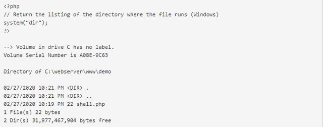
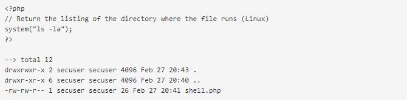

# Shell
Webshell是经常使用的一种恶意脚本，其目的是获得对服务器的执行操作权限，比如执行系统命令、窃取用户数据、删除web页面、修改主页等，其危害不言而喻。黑客通常利用常见的漏洞，如SQL注入、远程文件包含(RFI)、FTP，甚至使用跨站点脚本攻击(XSS)等方式作为社会工程攻击的一部分，最终达到控制网站服务器的目的。

Webshell常用的PHP函数
Webshell几乎适用于所有Web编程语言。之所以关注PHP，是因为它是web上使用最广泛的编程语言。下面是PHP中一些执行shell命令最常用的函数。

system()

system()函数将命令作为参数，并输出结果。

下面的示例是在Windows操作系统上运行dir命令，然后返回PHP文件所在目录的目录列表。
  

类似地，在Linux机器上执行ls命令也会得到类似的结果。

exec()

exec()功能是将命令作为参数，但不输出结果。如果指定了第二个可选参数，则返回结果为数组。否则，如果回显，只显示结果的最后一行。
  

用exec()函数执行echo命令，只会输出最后一行命令结果。

如果指定了第二个参数，则返回结果为数组

shell_exec()

shell_exec()函数类似于exec()，但是，其整个输出结果为字符串。

passthru()

passthru()执行一个命令并返回原始格式的输出。

proc_open()

proc_open()函数可能很难理解。简单地说，我们可以使用proc_open()，创建一个处理程序（流程），实现脚本和要运行的程序之间的通信。

倒引号

很多PHP开发人员并没有意识到这一点，但是PHP会首先执行shell命令中倒引号（`）内的内容。请注意，倒引号（`）和单引号（’）不同。

根据以上内容，下面是一个最简单的PHP Webshell。

它使用 system()函数来执行通过 ‘cmd’ HTTP 请求中GET参数传递过来的命令。

我们已经确定了这些函数（以及其他一些函数）可能非常危险。更危险的是，在安装PHP时，默认情况下会启用所有这些内置PHP命令，而大多数系统管理员不会禁用这些函数。如果不确定在系统上是否启用了这些函数，输入以下内容将返回已启用的危险函数的列表。

在采用默认安装的情况下，下列函数是默认启用的。

三、黑客如何隐藏Webshell
修改报头

黑客使用用户代理字符串而不是通过$_POST 请求参数来传递命令的。

然后，黑客可以通过将命令放在User-Agent HTTP报头中来制作特定的HTTP请求。

在服务器日志中可以看到这一行为的效果，其中第二个请求中的HTTP User-Agent被cat /etc/passwd命令替换了。

上述方法会产生很大噪声，可以很容易地提示管理员查看服务器日志。但采用下列方法，管理员这很难发现。

这种方法没有留下关于执行命令的任何可见轨迹（至少在访问日志中是这样）。

隐藏在正常文件中

黑客用来隐藏Webshell最简单的一个方法是将它们上传到深层子目录中和/或使用随机名称。

此外，一种更有效的方法是将Webshell代码嵌入到现有的合法文件中。

或使用CMS（例如WordPress）

注意：黑客通常会在函数前使用@运算符，以防发生任何错误，写入错误日志。

混淆

黑客使用各种混淆技术，以避免被管理员检测到。他们不断提出新的更复杂的方法来隐藏其代码并绕过安全系统。下面是我们看到的一些最常用的技术。

（1）删除空格换行符

通过从代码块中删除空格换行符，代码看起来像一个大字符串，这就使得代码的可读性降低并且更难识别脚本要实现什么目的。

（2）加密技术

该技术可以对代码进行加密，降低代码的可读性，并且充分利用运行时可以重建代码的各种函数。

（3）使用Hex进行混淆

ASCII字符的十六进制值也可以用于进一步混淆Webshell命令，下面的例子可以很好地说明混淆技术在Webshell中的应用。

以下是上述字符串的十六进制值。

因此，以下代码可用于接受十六进制编码的字符串并将其转化为PHP代码。

输出结果类似于下图。

（4）通过可控输入实现混淆

PHP常用的可控输入包括: $_GET, $_POST, $_REQUEST,$_FILES,$_SERVER $_COOKIE等，是PHP预定义的变量，可以将黑客自定义的值传递给浏览器中。

以下示例很简单，但很实用。虽然未对代码进行编码或加密，但由于它没有使用任何可疑的函数名（例如eval()或assert()）、冗长的编码字符串、复杂的代码，因此与之前的代码相比，可检测性仍然较低。最重要的是，当管理员查看日志时，它不会引起任何危险。

四、Webshell如何使用
我们以Weevely为例，来分析Webshell是如何使用的。Weevely是一个类似PHP telnet的轻量级Webshell，具有多个选项，在本示例中我们将使用这些选项。

为进行演示，我们将使用Weevely创建后门代理，部署在目标服务器上。我们只需要指定一个密码和一个文件名即可。然后用密码来访问后门。

agent.php 包含以下编码文件。

将agent.php重命名为ma.php，然后将其上传到失陷的服务器。然后，我们不使用浏览器访问文件，而是使用shell连接到该文件。

现在我们已经拥有了访问目标服务器的后门，可以执行命令了。

检查服务器的访问日志，我们会注意到有些奇怪。

发送的请求已编码，来源网址也似乎是Google。如果我们要分析日志中是否有恶意活动，这非常有可能对我们造成困扰，因为Google应该是合法的引荐来源。当然，这是防止被检测出来的Webshell策略的一部分。

我们使用的Webshell的另一个有趣功能是反弹TCP Shell选项。这是指失陷的服务器将反向与我们建立连接，或者我们请求连接到Webshell。

在源计算机上，我们在端口8181上设置了Netcat侦听器。

使用已经建立的后门shell连接，启动反弹TCP请求。

现在已经建立了反弹shell连接（192.168.5.25 → 192.168.5.26）。

通过使用反弹TCP Shell控制服务器，而访问或错误日志中没有任何痕迹，因为通信是通过TCP（第4层）而不是HTTP（第7层）进行的。

五、Webshell检测和预防
检测

 如果管理员怀疑其系统中存在Webshell或只是进行例行检查，则需要检查以下内容。

首先，必须针对Webshell正在使用的常见关键字过滤服务器访问和错误日志，包括文件名称和/或参数名称。您可根据下面的示例，在Apache HTTP Server访问日志中的URL中搜索字符串文件。

必须在文件系统（通常是Web服务器根目录）中搜索文件或文件名中的通用字符串。

 如果搜索到很长的字符串，这可能表示已进行了编码。一些后门程序具有数千行代码。

搜索最近X天修改过的文件。在以下示例中，我们搜索了前一天更改的* .php文件，但建议搜索所有更改过的文件，因为Webshell也可以嵌入到图像或任何其他文件中。

监视网络中存在异常的网络流量和连接。

分析.htaccess文件是否进行了修改。以下是攻击者可能对.htaccess文件进行更改的示例。

预防

通常，黑客会利用Web服务器软件中存在的漏洞来安装Webshell。因此，消除这些漏洞对于避免失陷Web服务器的潜在风险很重要。以下是一些与Webshell相关的预防措施。

如果不使用，要禁用危险的PHP函数，例如exec()、shell_exec()、passthru()、system()、show_source()、proc_open()、pcntl_exec()、eval()与assert()。

如果必须要启用这些命令，请确保未授权用户无法访问这些脚本。此外，使用escapeshellarg()和escapeshellcmd()可以确保不能将用户输入注入到shell命令中，从而导致命令执行漏洞。

如果Web应用程序正在使用上传表单，请确保上传的表单是安全的，并且仅允许上传白名单所允许的文件类型。

不要相信用户输入的信息。

不要盲目使用在线论坛或网站上的代码。

对于WordPress，如果不需要，要避免安装第三方插件。如果需要使用插件，请确保插接件其信誉良好且经常更新。

在敏感目录（如图片或上传）中禁用PHP执行。

锁定Web服务器用户权限。

上面给出的是一些简单的Webshell检测和预防措施。面对较为复杂的Webshell攻击，则需要采用一些专业的Webshell检测工具来实现了。

六、总结
Webshell编码简单，使用方便，但由于许多Web服务器的设置方式问题，即使是一个简单的脚本也足以造成严重的破坏。这就是为什么有成千上万的公开Webshell的原因所在。Webshell存在如此多的变种，导致入侵检测和入侵防御系统（IDS/IPS）很难检测到它们，尤其是当使用签名来检测此类Webshell时。有些Webshell非常复杂，即使进行行为分析，也几乎无法检测到。

话虽如此，但Webshell只是漏洞利用后的实施工具，这就意味着首先要尽早检测出Webshell，防止其上传后进行漏洞利用。