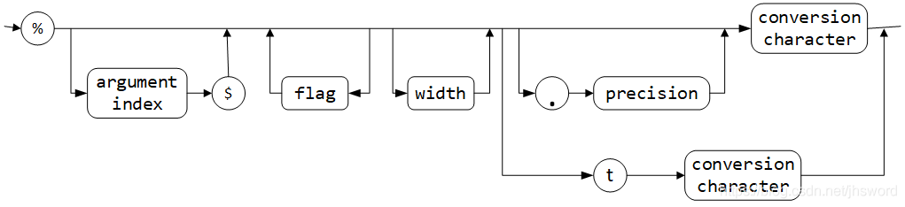

# 输出格式控制
## 参数总览
>%[argument_index$][flags][width][.precision]conversion
>+ 可选的 argument_index 是十进制整数，表示参数列表中参数的位置。第一个参数由“1\$”引用，第二个由“2\$”引用，等等。argument_index必须紧跟%后面，并以\$结束。
note: 参数索引值从1开始，而不是从0开始，%1\$对第一个参数格式化。这就避免了与0标志混淆。
>+ 可选 flags 指定格式化输出外观的各种标志。有效标志集取决于conversion。
>+ 可选 width是正十进制整数，表示要写入到输出的字符个数(注意对于浮点数：也包含小数点所占的1个字和 负数的负号所占的1个字符)。当实际字符数小于指定的宽度时，最前面用flags指定的标志填充(若未指定，默认用空格)。
eg: v=2.3, %5.2f 输出5.20，且前面包含1个空格。共打印5个字符，整数位1个5，1个小数点，2个精度，长度为4，比指定的宽度少1为，用1个前导空格代替。
>+ 可选precision是一个非负十进制整数，通常用于限制字符数。具体行为取决于转换。
>+ conversion(必需)是一个字符，指示如何格式化参数。给定参数的有效转换集取决于参数的数据类型。

  
## 用于printf flags(标志) 说明
| 标志 | 目的 | 示例 |
| --- | --- | --- |
| + | 打印正数和负数的符号 | +3333.33 |
| 空格 | 在正数之前添加空格 | | 3333.33\| |
| 0 | 数字前面补0 | 003333.33 |
| \- | 左对齐(不指定-时，默认为右对齐） | |3333.33 \| |
| \( | 将负数括在括号内 | \%d,-90输出\(90\) |
| ,(英文逗号） | 添加分组分隔符，**只对定点浮点数整数部分添加分组分隔符，小数部分不会添加** | 3,333.33 |
| #(对于f格式） | 包含小数点 | 3,333. |
| #(对于x或o格式） | 添加前缀0x或0 | 0xcafe |
| \$ | 指定要格式化的参数索引。例如，\%1 d d \%1 dx 将以十进制和十六进制格式打印第1个参数 | 159 9F |
| \< | ＜格式化前面说明的数值。例如，`%d<%x` 将以十进制和十六进制打印同一个值 | 159 9F |

## 用于printf conversion(转换符) 说明
| 转换符 | 类型 | 示例 | 转换符 | 类型 | 示例 |
| --- | --- | --- | --- | --- | --- |
| d | 十进制整数 | 159 | s | 字符串 | hello |
| x | 十六进制整数 | 9f | c | 字符 | H |
| o | 八进制整数 | 237 | b | 布尔 | true |
| f | 定点浮点数 | 1.59e+01 | h | 散列码 | 42628b2 |
| e | 指数浮点数 |  | tx或Yx | 日期时间(T强制大写） | 已经过时，应当改为使用 java.time 类。 |
| g | 通用浮点数\(e和f中较短的一个\) | —— | \% | 百分号 | \% |
| a | 16进制浮点数 | 0x1.fccdp3 | n | 与平台有关的换行符 | —— |

## 时间的格式化
Note: 以下格式符已经过时，对于新的代码，应当使用 java.time 包的方法。

eg: System.out.printf("%tc",new Date());这条语句将用下面的格式打印当前的日期和时间:
>Mon Feb 09 18:05:19 PST 2015

下面的转换符前面都必须用 t/T 修饰。

| 转换符 | 类型 | 示例 |
| --- | --- | --- |
| c | 完整的日期和时间 | Mon Feb 09 18:05:19 PST 2015 |
| F | ISO 8601日期 | 2015/2/9 |
| D | 美国格式的日期（月/日/年） | 02/09/2015 |
| T | 24小时时间 | 18:05:19 |
| r | 12小时时间 | 6:05:19 |
| R | 24小时时间，没有秒 | 18:05 |
| Y | 4位数字的年（前面补0 | 2015 |
| y | 年的后两位数字（前面补0） | 15 |
| C | 年的前两位数字（前面补0） | 20 |
| B | 月的完整拼写 | February |
| b或h | 月的缩写 | Feb |
| m | 两位数字的月（前面补0） | 02 |
| d | 两位数字的日（前面补0） | 09 |
| e | 两位数字的日（前面不补0 | 9 |
| A | 星期几的完整拼写 | Monday |
| a | 星期几的缩写 | Mon |
| j | 三位数的年中第几天（前面补0）,在001到366之间 | 069 |
| H | 两位数字的小时（前面补0），在0到23之间 | 18 |
| k | 两位数字的小时（前面不补0），在0到23之间 | 18 |
| I | 两位数字的小时（前面补0），在01到12之间 | 06 |
| l | 两位数字的小时（前面不补0），在1到12之间 | 6 |
| M | 两位数字的分钟（前面补0） | 05 |
| S | 两位数字的秒（前面补0） | 19 |
| L | 三位数字的毫秒（前面补0） | 047 |
| N | 九位数字的毫微秒（前面补0） | 047000000 |
| p | 上午或下午的标志 | pm |
| z | 从 GMT 起，RFC 822 数字位移 | \-800 |
| Z | 时区 | PST |
| s | 从格林尼治时间 1970-01-01 00:00:00 起的秒数 | 1078884319 |
| Q | 从格林尼治时间 1970-01-01 00:00:00 起的毫秒数 | 1078884319047 |