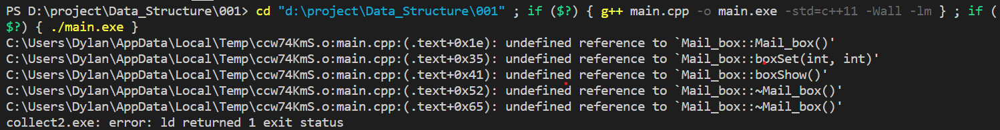
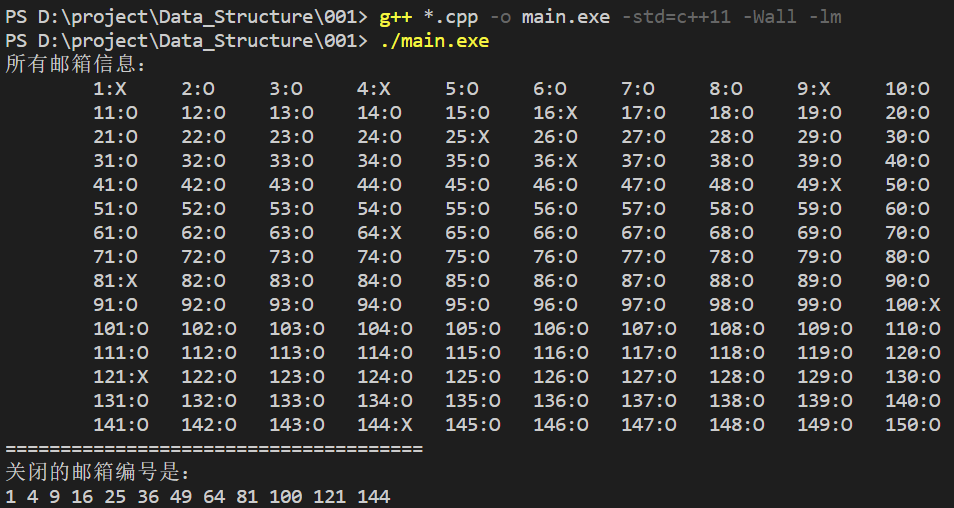

# 在VSCode中分文件编译C++的指令问题   {.C++ .VSCode}
>日期：2021.9.19
语言：C++
环境：VSCode

## 问题
用VSCode编写C++程序时遇到问题，在分文件编写一个自定义类文件后进行编译，出现错误：
  
## 解决
文件夹中共有三个文件分别为
> + main.cpp //主函数
> + Mail_box.h //类声明
> + Mail_box.cpp //类定义

很显然问题是主函数无法找到类定义，检查后发现文件与文件之间的包含关系是没有问题的，在VS上可以跑起来。问题显然出现在VSCode上，思索一番，想到我的VSCode用了插件Code Runner。Code Runner这个插件有一定局限性，它按照事先编辑好的方式去代替人工编译运行的繁琐。于是注意到指令：
```shell
cd "d:\project\Data_Structure\001" ; if ($?) { g++ main.cpp -o main.exe -std=c++11 -Wall -lm } ; if ($?) { ./main.exe }
//PS：if($?)中的$?是是显示最后命令的退出状态，0表示没有错误，其他表示有错误
```
问题出现在 **g++** 和 **-o** 之间编译需要将想要编译的.cpp文件放在一起，否则就会出现找不到类定义的问题，手动在命令行输入：
```shell
//编译
g++ *.cpp -o main.exe -std=c++11 -Wall -lm
//运行
./main.exe
//将所有.cpp文件一起进行编译
```
成功运行
  

## 总结
不能仅仅是依赖工具给我们的便利而不去思考其背后的原理，要掌握一般方法及工具的工作方式，才能让我们工作和学习效率变得更高。